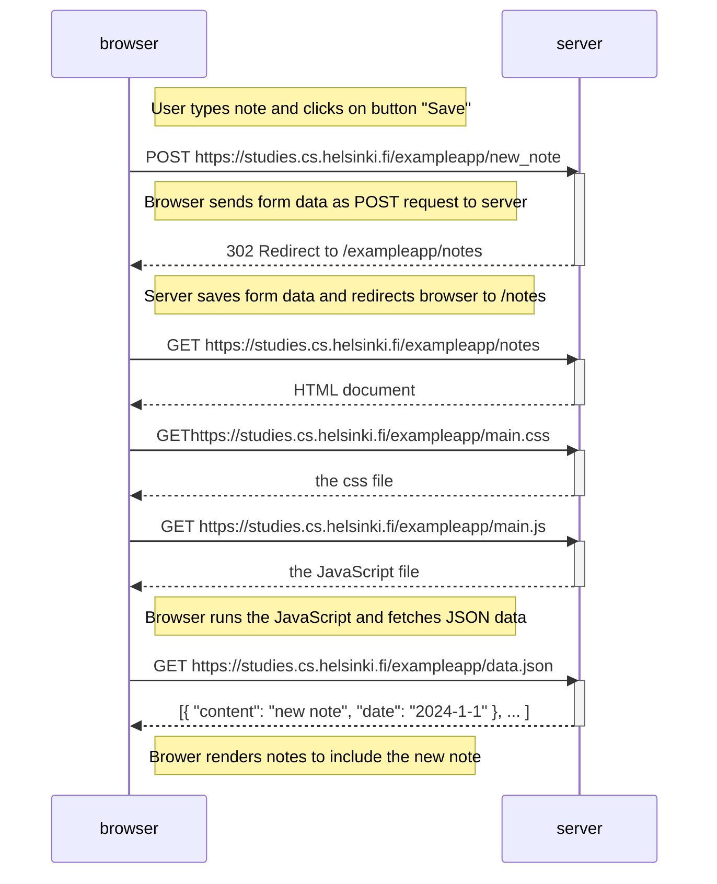

```mermaid
sequenceDiagram
    participant browser
    participant server

    Note right of browser: User types note and clicks on button "Save"

    browser->>server: POST https://studies.cs.helsinki.fi/exampleapp/new_note
    activate server
    Note right of browser: Browser sends form data as POST request to server
    server-->>browser: 302 Redirect to /exampleapp/notes
    deactivate server
    Note right of browser: Server saves form data and redirects browser to /notes

    browser->>server: GET https://studies.cs.helsinki.fi/exampleapp/notes
    activate server
    server-->>browser: HTML document
    deactivate server

    browser->>server: GEThttps://studies.cs.helsinki.fi/exampleapp/main.css
    activate server
    server-->>browser: the css file
    deactivate server

    browser->>server: GET https://studies.cs.helsinki.fi/exampleapp/main.js
    activate server
    server-->>browser: the JavaScript file
    deactivate server

    Note right of browser: Browser runs the JavaScript and fetches JSON data

    browser->>server: GET https://studies.cs.helsinki.fi/exampleapp/data.json
    activate server
    server-->>browser: [{ "content": "new note", "date": "2024-1-1" }, ... ]
    deactivate server

    Note right of browser: Brower renders notes to include the new note
```