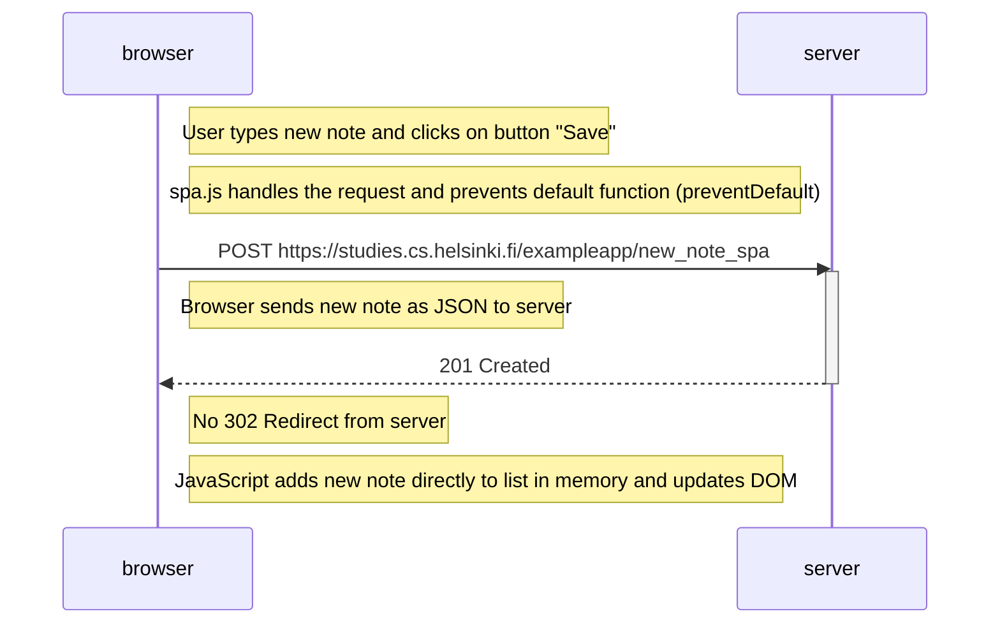

```mermaid
sequenceDiagram
    participant browser
    participant server

    Note right of browser: User types new note and clicks on button "Save"

    Note right of browser: spa.js handles the request and prevents default function (preventDefault)

    browser->>server: POST https://studies.cs.helsinki.fi/exampleapp/new_note_spa
    activate server
    Note right of browser: Browser sends new note as JSON to server
    server-->>browser: 201 Created
    deactivate server

    Note right of browser: No 302 Redirect from server
    Note right of browser: JavaScript adds new note directly to list in memory and updates DOM
```